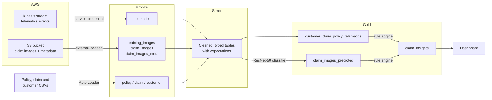
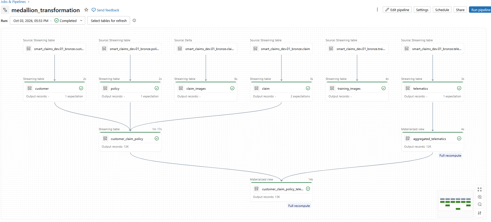
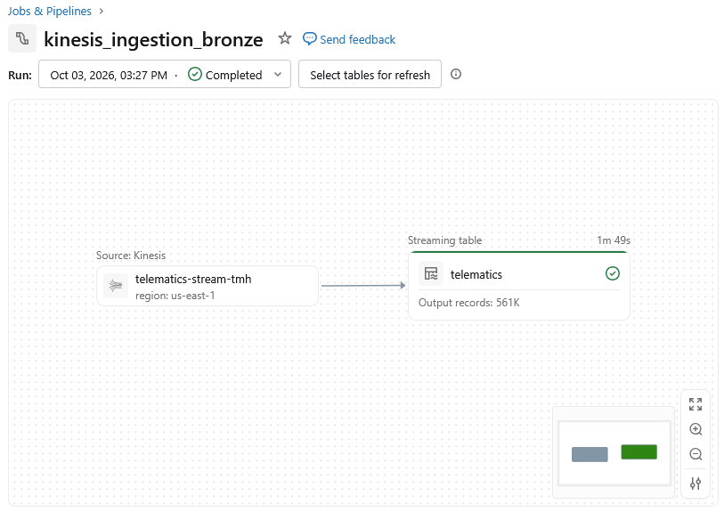
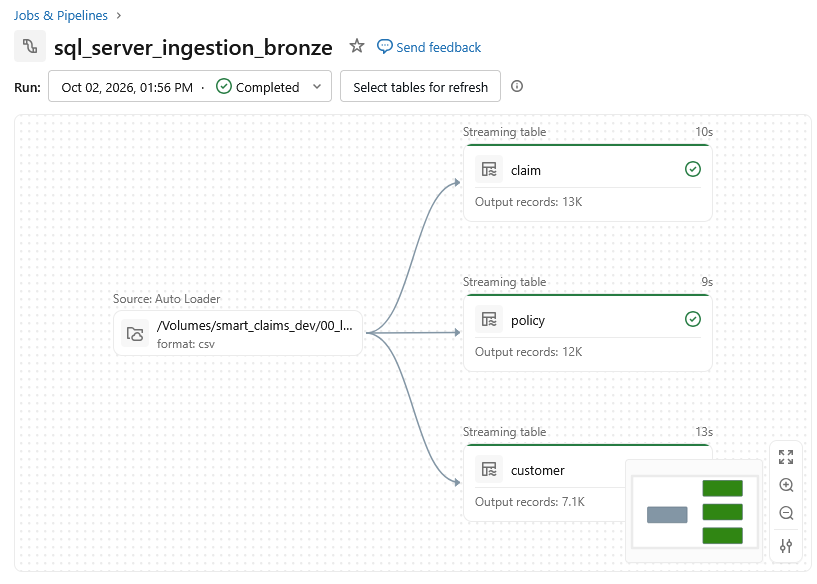
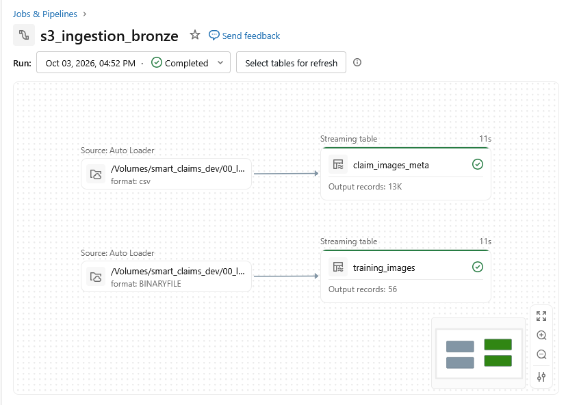

# Databricks Smart Claims Lakehouse

An end-to-end insurance claims pipeline on Databricks and AWS. Streaming vehicle telematics, policy and claims records, and accident photos are ingested into a Bronze/Silver/Gold lakehouse. An image classifier scores damage severity, and a rule engine flags claims that need investigation. The results feed a dashboard.


## Architecture



| Layer | What happens |
|---|---|
| **Bronze** | Raw data lands as-is: telematics from Kinesis, CSVs and images through Auto Loader. |
| **Silver** | Types, dates and names are standardized, and data quality expectations record rule violations. |
| **Gold** | Claims are joined to policies, customers and per-vehicle driving data, then scored by the model and rule engine. |



*A rerun with no new data: the Silver streaming tables process only new records (none here), while the Gold materialized views recompute from their inputs.*

## Tech stack

- **Databricks:** Delta Live Tables (Lakeflow Declarative Pipelines), Auto Loader, Unity Catalog, MLflow, AI/BI dashboards
- **AWS:** Kinesis Data Streams, S3, IAM, CloudShell
- **Python:** PySpark, PyTorch, Hugging Face Transformers, boto3, pandas

## What's in the pipeline

**Streaming ingestion.** `telematics_producer.py` replays telematics events into a Kinesis stream with boto3, sending batches of 500 records and retrying throttled records. Databricks reads the stream through a Unity Catalog **service credential** backed by a cross-account IAM role. The role is read-only and scoped to a single stream, with an External ID condition and a self-assuming trust policy.

**Batch ingestion.** Claim photos and their metadata live in S3 and reach Databricks through a **storage credential**, an **external location**, and external volumes. Auto Loader ingests the images as binary files, and a separate stream archives processed images with `cleanSource`. Policy, claim and customer records are loaded from CSV with Auto Loader.

| Kinesis | CSV | S3 |
|---|---|---|
|  |  |  |

**Transformation.** The Silver layer parses timestamps and mixed date formats, fixes negative premiums, splits customer names, and labels training images from their file names. Expectations check identifiers and coordinate ranges. The Gold layer aggregates telematics per vehicle and joins claims, policies and customers.

**Machine learning.** A ResNet-50 model, pre-trained on ImageNet, is fine-tuned to classify vehicle damage as `ok`, `minor` or `major`. Training runs are tracked in MLflow, and the model is registered in Unity Catalog with a `prod` alias. The model then scores the claim photos.

**Rule engine.** Business rules are stored as SQL expressions in a Delta table and applied dynamically. Rules can be added or changed without editing code. They check policy dates, claim amounts against the insured value, reported severity against the predicted damage, and driving speed. They then decide whether to release funds or investigate.

## Repository structure

```
ingestion/
  kinesis_ingestion_bronze/      Kinesis → bronze telematics (kinesis_parsed.py; kinesis_simple.py is the raw first test)
  sql_server_ingestion_bronze/   CSV → bronze policy, claim, customer
  s3_ingestion_bronze/           S3 images and metadata → bronze, plus the claim image archiving stream
transformation/
  medallion_transformation/      bronze → silver → gold
ml/
  ML_Notebook_2                  model training, registration and scoring
  Rule_Engine                    rule table and claim decisions
dashboard/                       dashboard definition, PDF export and screenshot
aws/                             IAM trust and permission policies (account ID and External IDs redacted)
images/                          pipeline graph screenshots
telematics_producer.py           Kinesis producer (run in AWS CloudShell)
```

## Changes from the original course

This project follows [Databricks Zero to Hero](https://github.com/datamyselfai/databricks-zero-to-hero-course) by Thomas Hass. I built it on **Databricks Free Edition**, which required these changes:

- **SQL Server ingestion replaced.** Free Edition has only serverless compute, but the Lakeflow Connect gateway for SQL Server needs classic compute. I loaded the source CSVs with Auto Loader instead and renamed columns to match the schema the Silver layer expects.
- **Kinesis producer written.** The course repository includes the telematics data but no code to send it to Kinesis, so I wrote `telematics_producer.py`.
- **IAM trust policy fixed.** Unity Catalog requires roles to be self-assuming, so I added each role's own ARN to its trust policy.
- **Library versions updated.** The course's pinned package versions downgraded core packages on the newer serverless runtime and crashed the Python kernel. I installed versions compatible with the runtime and updated renamed APIs (`eval_strategy`, `processing_class`, MLflow 3 model logging).
- **Claim scoring restructured.** Running the model inside a Spark join could score each image once per joined claim (about 13K times instead of 15). I scored the 15 images first and joined the results afterwards.

I also fixed bugs that surfaced along the way:

- **Inverted policy date rule.** The original rule marked a claim valid only when the policy had already expired before the claim date. It now checks that the claim falls within the policy period.
- **String comparisons on numeric columns.** CSV ingestion stored amounts and ages as text, so comparisons ran alphabetically (`"9000" >= "32000.0"` is true). I added numeric casts in the rule engine and the driver age chart.
- **Missing CSV header option** in the image metadata ingestion, which turned the header row into data.

## Results

| Table | Rows |
|---|---|
| Bronze telematics events | 561K |
| Claims | 13K |
| Policies | 12K |
| Customers | 7.1K |
| Training images | 56 |
| Claim images | 15 |

The classifier was trained on 44 images and validated on 12. Most of its errors confused neighbouring severity levels. With this little training data, the model demonstrates the workflow rather than production-grade accuracy.

## Running it yourself

1. **AWS:** create a Kinesis stream (provisioned, 1 shard) and an S3 bucket. Create IAM roles for Databricks using the policies in `aws/`, with your account ID and External IDs filled in.
2. **Databricks:** create a `smart_claims_dev` catalog with schemas `00_landing`, `01_bronze`, `02_silver` and `03_gold`. Then create the service credential, storage credential, external location and volumes.
3. **Data:** download the source data from the [course repository](https://github.com/datamyselfai/databricks-zero-to-hero-course/tree/main/data). Upload the images and metadata to S3 and the CSVs to a volume.
4. **Run the pipeline:** stream telematics with `python3 telematics_producer.py --limit 0` in CloudShell. Then run the ingestion pipelines, the medallion pipeline, the ML notebook and the rule engine, in that order.

Delete the Kinesis stream when you're done. It bills by the hour.

## Acknowledgements

The course design and source data come from [Databricks Zero to Hero](https://github.com/datamyselfai/databricks-zero-to-hero-course) by Thomas Hass. The source data is not included in this repository.
